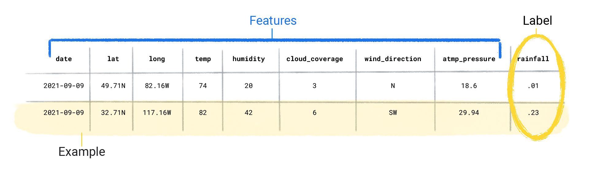
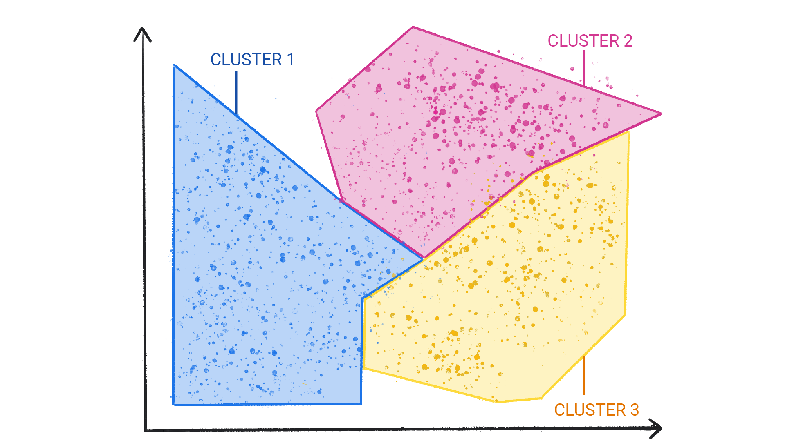

# Key Summary from the Last 5 Weeks – Machine Learning Course**

- [**Supervised Learning**](https://developers.google.com/machine-learning/intro-to-ml/supervised)
  - Focused on both **classification** and **regression** tasks:
    - **Classification example**: *[Titanic](../datasets/titanic-clean.csv) survival prediction*  
      - Features: age, gender, passenger class, etc.  
      - Label: survived (yes/no)
    - **Regression example**: *[Fuel consumption](../datasets/auto-mpg.csv) prediction*  
      - Features: engine size, car weight, fuel type, etc.  
      - Label: fuel efficiency or consumption rate
  - Features = input variables; Label = target to predict
  - Goal: Train a model to predict the label from features
  - Data split: Typically 80% for training, 20% for testing

    

- **Classical Machine Learning**
  - Requires **manual feature engineering**, which can be complex or infeasible (e.g., in image recognition)
  - Used **Scikit-learn** for building models

- **Deep Learning (DL)**
  - Still supervised (uses labels), but model learns features automatically
  - Requires **large datasets** for training
  - If data is limited, we can use **data augmentation** (e.g., rotating images) to create more variety
  - Used **TensorFlow/Keras** for DL model implementation

- **Mini Project**
  - Made **API calls to Gemini Large Language Model (LLM) **
  - Used the responses to build a **UI with Gradio**

- **Unsupervised Learning**
  - When labels are not available
  - Used for tasks like **clustering**

  
