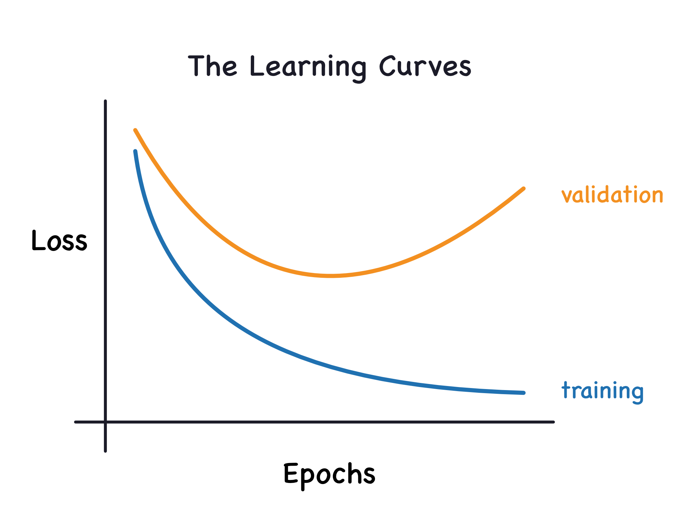

# Part 1: Deep Learning Fundamentals & Image Classification with ANNs

> [!NOTE]  
> Building upon concepts potentially explored last week with regression tasks, this week our focus shifts specifically to classification problems using Artificial Neural Networks. We will apply fundamental deep learning principles – many of which are common to both regression and classification, to the task of image recognition using the MNIST dataset. This practical application will highlight the capabilities and limitations of basic ANNs for image data, thereby motivating the need for Convolutional Neural Networks (CNNs), which will be covered in Part 2. While some core concepts like layers, activation functions, and the Keras workflow might seem familiar, their application here is geared towards classification and understanding the challenges specific to image data.

<!-- This document introduces fundamental Deep Learning (DL) concepts. Deep Learning uses Artificial Neural Networks (ANNs) – computational models inspired by the structure of the brain – with multiple layers to learn patterns directly from data. This approach has proven effective for tasks like image recognition and natural language processing, partly because DL models can automatically learn **hierarchical data representations**. This means they learn simple features first, then combine them to understand more complex patterns, much like how humans recognize objects. -->

This part covers:

1.  Definition of Deep Learning and introduction to libraries (TensorFlow/Keras).
2.  Core concepts: neurons, layers, activation functions, parameters vs. hyperparameters.
3.  Distinctions between network types (MLP vs. DNN).
4.  The Keras Sequential API for model building.
5.  Loss functions for classification tasks.
6.  Concepts of overfitting, underfitting, and regularization (Early Stopping).
7.  Application of these concepts to build, train, and evaluate an Artificial Neural Network (ANN) for classifying handwritten digits from the MNIST dataset.

---

## I. Introduction to Deep Learning & Frameworks

**1.1 What is Deep Learning (DL)?**

Deep Learning is a subfield of machine learning based on artificial neural networks with multiple layers (hence "deep"). Unlike traditional machine learning algorithms that often require manual **feature engineering** (where domain experts analyze the data and explicitly define the most relevant input characteristics or "features" for the model), deep learning models aim to automatically learn relevant features and hierarchical representations directly from the raw data.

Starting from raw input, each successive layer learns increasingly complex features. For example, in image recognition, initial layers might detect simple edges, subsequent layers might combine edges to recognize shapes, and deeper layers might identify objects based on these shapes. This ability to learn features automatically makes DL particularly powerful for complex tasks involving **unstructured data** (data without a predefined format, like images, free text, and audio) where manual feature engineering is difficult or impractical.

**1.2 Key Deep Learning Libraries**

Several software libraries facilitate the development of deep learning models. These libraries provide pre-built components and tools to simplify the process. Two prominent ones are:

*   **TensorFlow & Keras:**
    *   **TensorFlow:** Developed by Google, TensorFlow is a powerful open-source library for numerical computation and large-scale machine learning. It provides low-level **APIs** (Application Programming Interfaces - sets of rules and tools for building software) for fine-grained control but can be complex for beginners.
    *   **Keras:** Keras is a high-level API for building and training neural networks. It emphasizes user-friendliness, modularity, and rapid experimentation. Keras can run on top of different **backends** (underlying computational engines like TensorFlow), including TensorFlow (most common), Theano, or CNTK. We will use the `tensorflow.keras` implementation, which integrates Keras directly within TensorFlow. Its ease of use makes it suitable for beginners and practitioners.

*   **PyTorch/[Fastai](https://docs.fast.ai/):**
    *   Developed by Facebook's AI Research lab (FAIR), PyTorch is another major open-source library. It is widely adopted, especially in the research community, and is known for its Pythonic feel, flexibility, and **dynamic computation graphs** (meaning the network's structure can potentially be altered during execution, offering flexibility for complex scenarios, although less common in introductory models).

**Focus:** This summary will utilize **Keras (specifically `tensorflow.keras`)** for all practical examples due to its clear syntax and streamlined workflow for common tasks.

---

## II. Core Concepts: Building Blocks of Neural Networks

Before building models, understanding the fundamental components is essential.

**2.1 Neurons and Layers**

*   **Neuron (or Unit):** The basic computational unit in a neural network. It receives one or more inputs (values from the previous layer or the initial data). Inside the neuron, it performs a **weighted sum** (each input is multiplied by a corresponding 'weight' or importance factor, and these products are summed together), adds a **bias term** (an additional constant value that helps the model fit the data better), and then passes this combined result through an **activation function** (explained below) to produce the neuron's output.
*   **Layer:** Neurons are organized into layers. A typical network processes data sequentially through these layers. Common types include:
    *   **Input Layer:** Not technically a computational layer, but represents the structure receiving the raw input data (features). The number of "slots" or connections corresponds to the number of input features.
    *   **Hidden Layers:** Layers between the input and output layers. These layers perform the intermediate computations. The term "hidden" implies their outputs are not directly observed as the final result but are used as inputs for subsequent layers. They perform the crucial task of **feature extraction** – transforming the input data into more abstract and useful representations. A network can have zero, one, or multiple hidden layers.
    *   **Output Layer:** The final layer, which produces the network's prediction. The number of neurons and the activation function depend on the type of task (e.g., one neuron for predicting a single continuous value in regression, or multiple neurons for predicting probabilities of different categories in classification).

**2.2 MLP vs. DNN**

These terms describe types of neural networks:

*   **MLP (Multilayer Perceptron):** Refers to a specific class of **feedforward** neural networks (meaning data flows in one direction, from input to output, without loops). Key characteristics include:
    *   An input layer, one or more hidden layers, and an output layer.
    *   All layers are **fully connected** (or **Dense**), meaning each neuron in one layer is connected to *every* neuron in the next layer. This implies that every output from one layer contributes to every computation in the next layer.
    *   Typically use non-linear activation functions in the hidden layers.

*   **DNN (Deep Neural Network):** A broader term referring to any neural network architecture with **multiple hidden layers** (conventionally, two or more). The "deep" aspect refers to this depth of layers.

**Relationship Summary:**

| Term         | Meaning                                                                      | Connection Type          | Depth Requirement   |
| :----------- | :--------------------------------------------------------------------------- | :----------------------- | :------------------ |
| **MLP**      | Specific architecture: fully connected layers.                               | Fully Connected (Dense)  | ≥ 1 hidden layer    |
| **DNN**      | General term: any network with multiple hidden layers.                       | Can be Dense, Conv, RNN etc. | ≥ 2 hidden layers |
| **Deep MLP** | An MLP with 2 or more hidden layers. It *is* a type of DNN.                  | Fully Connected (Dense)  | ≥ 2 hidden layers |
| **CNN / RNN**| Networks using Convolutional or Recurrent layers. Also DNNs if deep (≥2 layers). | Convolutional/Recurrent | Often ≥ 2 layers    |

**Key Takeaway:** All MLPs with two or more hidden layers are DNNs. However, DNNs can also use other layer types (like Convolutional layers for images or Recurrent layers for sequences) instead of only fully connected layers.

**2.3 What Makes a Network "Deep"?**

The term "deep" generally implies the presence of **two or more hidden layers**. The depth allows the network to learn a **hierarchy of features**, meaning simpler features learned in early layers (like edges in an image) are combined by later layers to form more complex features (like shapes or object parts). This hierarchical feature learning is a key reason for the success of deep learning on complex problems.

**2.4 How Many Neurons per Layer?**

Determining the optimal number of neurons (units) in each hidden layer requires experimentation, as there's no single formula. Considerations include:

*   **Task Complexity:** More complex relationships in the data might require more neurons or layers to model adequately.
*   **Dataset Size:** Larger datasets can often support larger networks (more neurons/layers) without severe overfitting.
*   **Input Features:** The number of input features provides context but doesn't dictate hidden layer size.
*   **Computational Resources:** More neurons result in more parameters to train, increasing memory usage and training time.
*   **Overfitting Risk:** Excessively large layers might lead the model to memorize the training data (overfitting) rather than learning general patterns.

**General Heuristics (Starting Points):**

*   **Powers of 2:** Values like 32, 64, 128, 256 are common, sometimes offering computational efficiency.
*   **Funnel Structure:** Often, the number of neurons decreases in successive hidden layers (e.g., Input -> 128 -> 64 -> Output), gradually compressing the information.
*   **Problem Type:** Simple problems might use layers with tens to hundreds of neurons. Complex problems might use layers with hundreds or thousands, especially in the fully connected parts of larger models.

**Recommendation:** Begin with a simpler architecture (e.g., 1-2 hidden layers, 32-128 neurons per layer) and incrementally add complexity if needed, carefully observing the impact on performance and overfitting.

**2.5 Activation Functions**

Activation functions introduce **non-linearity** into the network. This is crucial because real-world data patterns are rarely simple linear relationships. Without non-linear activation functions, a deep network of linear layers would behave just like a single linear layer, limiting its learning capacity. The activation function determines the output of a neuron based on the weighted sum of its inputs plus the bias.

**Common Choices and Use Cases:**

*   **ReLU (Rectified Linear Unit):**
    *   *Function:* `f(x) = max(0, x)` (Outputs the input if positive, zero otherwise).
    *   *Use Case:* The most common choice for **hidden layers**. It is computationally efficient and helps mitigate the **vanishing gradient problem** (a situation in deep networks where the signals used to update the weights in early layers become extremely small, effectively stopping learning).
    *   *Output Range:* \[0, ∞)
*   **Linear (or 'None'):**
    *   *Function:* `f(x) = x` (Outputs the input directly).
    *   *Use Case:* Typically used in the **output layer for regression tasks**, where the prediction can be any continuous value.
    *   *Output Range:* (-∞, ∞)
*   **Sigmoid:**
    *   *Function:* `f(x) = 1 / (1 + exp(-x))` (S-shaped curve).
    *   *Use Case:* Primarily used in the **output layer for binary classification tasks**. Outputs a probability between 0 and 1. Less common in hidden layers now due to potential for vanishing gradients.
    *   *Output Range:* (0, 1)
*   **Softmax:**
    *   *Function:* Converts a vector of raw scores (logits) into a probability distribution (all output values are between 0 and 1 and sum to 1).
    *   *Use Case:* Used in the **output layer for multi-class classification tasks**. Each neuron's output represents the calculated probability for a specific class.
    *   *Output Range:* Vector where each element is \[0, 1] and the vector sum is 1.
*   **Tanh (Hyperbolic Tangent):**
    *   *Function:* `f(x) = tanh(x)` (Similar S-shape to sigmoid, but output centered around zero).
    *   *Use Case:* Sometimes used in hidden layers, especially in recurrent networks.
    *   *Output Range:* (-1, 1)

**2.6 Parameters vs. Hyperparameters**

Understanding this distinction is fundamental to working with neural networks:

*   **Parameters:** These are the variables *internal* to the model whose values are **learned from the data** during the training process. The learning process aims to find the optimal values for these parameters that minimize the error on the training data.
    *   *Examples:* **Weights** (numerical values representing the strength of connections between neurons) and **biases** (numerical values added at each neuron to shift the activation function). The number of parameters indicates the model's size.
*   **Hyperparameters:** These are configuration choices set by the user/developer **before** training begins. They define the model's structure and how the training algorithm works. They are *not* learned from the data. Finding good hyperparameters often requires trial-and-error or systematic tuning processes (like grid search or random search).
    *   *Examples:*
        *   Number of hidden layers
        *   Number of neurons per layer
        *   Choice of activation functions (`relu`, `softmax`, etc.)
        *   Choice of `optimizer` (e.g., 'adam', 'sgd') - the algorithm that updates parameters.
        *   `learning rate` - a crucial hyperparameter within the optimizer that controls the step size taken during parameter updates.
        *   Choice of `loss` function - the function measuring prediction error.
        *   `batch_size` - the number of training samples processed in one iteration before updating parameters.
        *   `epochs` - the number of times the entire training dataset is processed.
        *   **Regularization techniques** and their settings (methods to prevent overfitting, like dropout rate or parameters for early stopping).

---

## III. Practical Deep Learning with Keras: MNIST Classification

This section applies the concepts to classify MNIST handwritten digits using Keras.

**3.1 The MNIST Dataset**

MNIST is a standard dataset containing 70,000 grayscale images (28x28 pixels) of digits 0-9. It includes 60,000 images for training and 10,000 for testing. The task is to train a model to correctly identify the digit depicted in an image.

```python
# Code for Loading and viewing MNIST data
import tensorflow as tf
from tensorflow.keras import datasets
import matplotlib.pyplot as plt
import numpy as np

# Load the dataset; it's conveniently included in Keras
(X_train, y_train), (X_test, y_test) = datasets.mnist.load_data()

# Print shapes to understand the data dimensions
print("Training data shape:", X_train.shape) # (Num_samples, Height, Width)
print("Training labels shape:", y_train.shape) # (Num_samples,)

# Display first few images to visualize the data
plt.figure(figsize=(10, 3))
for i in range(5):
    plt.subplot(1, 5, i + 1); plt.imshow(X_train[i], cmap='gray'); plt.title(f"Label: {y_train[i]}"); plt.axis('off')
plt.suptitle("Sample MNIST Images"); plt.show()

# Set random seeds for numpy and tensorflow to ensure results are reproducible if code is run again
np.random.seed(42); tf.random.set_seed(42)
```

**3.2 Data Preparation**

Preparing data correctly is crucial for model performance.

*   **Normalization:** Pixel values (0-255) are scaled to the range [0, 1]. This helps the training process converge more stably and quickly, as neural networks often work best with small input values. Dividing by 255.0 achieves this.
*   **Flattening:** Standard ANNs (using `Dense` layers) expect input as a 1D vector. Although the images are 2D (28x28), we need to reshape them into a 1D array of 784 pixels (28 * 28 = 784). This reshaping will be performed by the first layer in our Keras model (`Flatten` layer).
*   **Labels:** The labels (`y_train`, `y_test`) are already integers (0-9), which is the format required by the chosen loss function (`sparse_categorical_crossentropy`).

```python
# Normalize pixel values by dividing by the maximum value (255.0)
X_train_normalized = X_train / 255.0
X_test_normalized = X_test / 255.0
# Verify the new range
print(f"Pixel values normalized. Range: [{X_train_normalized.min()}, {X_train_normalized.max()}]")
```

**3.3 Defining the Model Architecture (Sequential API)**

The Keras `Sequential` API provides a simple way to build models by creating a **linear stack of layers**. You add layers one by one in the order the data should flow through them.

```python
from tensorflow.keras import layers, models

# Define the ANN structure using the Sequential model
model = models.Sequential([
    # Input Layer / Flattening: Converts each 28x28 image into a 1D vector of 784 elements.
    # 'input_shape=(28, 28)' tells the layer the dimensions of each input sample.
    layers.Flatten(input_shape=(28, 28), name="Input_Flatten"),

    # Hidden Layer: A fully connected ('Dense') layer with 128 neurons.
    # 'activation='relu'' applies the ReLU activation function to the output of this layer.
    layers.Dense(128, activation='relu', name="Hidden_Layer_1"),

    # Output Layer: A Dense layer with 10 neurons (one for each digit class 0-9).
    # 'activation='softmax'' converts the outputs into probabilities for each class.
    layers.Dense(10, activation='softmax', name="Output_Layer")
], name="MNIST_ANN") # Naming the model is optional but helpful

print("\nModel Architecture Summary:")
# model.summary() provides a table showing layers, their output shapes, and the number of trainable parameters (weights + biases).
model.summary()
```

**3.4 Compiling the Model (Loss Function, Optimizer, Metrics)**

Before the model can be trained, it needs to be compiled. This step configures the learning process.

*   **Optimizer:** `'adam'` is chosen. The optimizer is the algorithm that iteratively updates the model's parameters (weights and biases) to minimize the loss function. Adam is an adaptive learning rate optimization algorithm that's efficient and often works well with default settings.
*   **Loss Function:** `'sparse_categorical_crossentropy'` is selected. The **loss function** quantifies the difference between the model's predictions and the actual labels. Minimizing this value is the goal of training. This specific loss function is suitable for multi-class classification tasks where the true labels are provided as integers (0, 1, 2, ...).
*   **Metrics:** `['accuracy']` is specified. **Metrics** are used to monitor and evaluate the model's performance but are not directly used by the optimizer to update weights. Accuracy measures the proportion of images that are correctly classified.

```python
# Compile the model with optimizer, loss function, and metrics
model.compile(optimizer='adam',
              loss='sparse_categorical_crossentropy',
              metrics=['accuracy'])
print("\nModel compiled.")
```

**3.5 Training the Model**

Training is performed using the `model.fit()` method. This involves feeding the training data (`X_train_normalized`, `y_train`) to the compiled model and allowing the optimizer to adjust the model parameters over several iterations.

*   **Epochs:** An epoch represents one complete pass through the entire training dataset. Training typically involves multiple epochs. `epochs = 10` means the model will see the entire training set 10 times.
*   **Batch Size:** The training data is usually processed in small groups called batches (e.g., `batch_size = 32`). The model's parameters are updated after processing each batch. Smaller batches can lead to noisier updates but may help escape local minima; larger batches provide smoother updates but require more memory.
*   **Validation Data:** `validation_split=0.2` reserves 20% of the training data to be used exclusively for validation. After each epoch, the model's performance (loss and metrics) is evaluated on this validation set. This provides an estimate of how well the model generalizes to data it hasn't been directly trained on within that epoch's parameter updates.
*   **`history` object:** The `fit` method returns a `History` object which stores the loss and metric values for both training and validation sets for each epoch. This is useful for plotting learning curves.

```python
# Define training hyperparameters
epochs = 10 # Number of times to iterate over the entire training dataset
batch_size = 32 # Number of samples per gradient update

print(f"\nStarting model training for {epochs} epochs...")
# Train the model
history = model.fit(
    X_train_normalized, y_train, # Training data and labels
    epochs=epochs,
    batch_size=batch_size,
    validation_split=0.2, # Use 20% of training data for validation during training
    verbose=1 # Show progress bar during training (0=silent, 1=bar, 2=line per epoch)
)
print("\nModel training completed.")
```

---

## IV. Evaluating and Improving Model Training

After training, evaluating performance and diagnosing potential issues is critical.

**4.1 Visualizing Training History**

Plotting the metrics stored in the `history` object (training vs. validation loss and accuracy) over epochs is essential for understanding how the training progressed. These plots are often called **learning curves**.

```python
# Extract data from the History object returned by model.fit()
history_dict = history.history
train_loss = history_dict['loss']; val_loss = history_dict['val_loss']
train_accuracy = history_dict['accuracy']; val_accuracy = history_dict['val_accuracy']
# Create an array representing the epoch numbers for plotting
epochs_range = range(1, len(train_loss) + 1)

# Create subplots for loss and accuracy
plt.figure(figsize=(14, 6))
# Plot Loss curves
plt.subplot(1, 2, 1) # Position for the first plot
plt.plot(epochs_range, train_loss, 'bo-', label='Training Loss') # Blue line with dots
plt.plot(epochs_range, val_loss, 'ro-', label='Validation Loss') # Red line with dots
plt.title('Training and Validation Loss')
plt.xlabel('Epoch'); plt.ylabel('Loss (Sparse Cat. Crossentropy)'); plt.legend(); plt.grid(True)
# Plot Accuracy curves
plt.subplot(1, 2, 2) # Position for the second plot
plt.plot(epochs_range, train_accuracy, 'bo-', label='Training Accuracy')
plt.plot(epochs_range, val_accuracy, 'ro-', label='Validation Accuracy')
plt.title('Training and Validation Accuracy')
plt.xlabel('Epoch'); plt.ylabel('Accuracy'); plt.legend(); plt.grid(True)
# Adjust layout and display the plots
plt.tight_layout(); plt.show()
```

*(Optional image placeholder)*



**4.2 Understanding Overfitting vs. Underfitting**

Analyzing the learning curves helps identify common training problems:

*   **Underfitting:**
    *   *Definition:* The model is too simple to learn the underlying structure of the data. It fails to achieve low error on both the training and validation sets.
    *   *Symptoms on Plots:* Both training and validation loss remain high. Accuracy remains low for both. Curves may plateau early at poor performance levels.
    *   *Possible Causes:* Insufficient model capacity (too few layers/neurons), inadequate training time (too few epochs), features don't contain enough information.
    *   *Remedies:* Increase model capacity, train longer, engineer better features (less relevant for DL), use a more suitable model type.

*   **Overfitting:**
    *   *Definition:* The model learns the training data *too well*, including noise and specific examples that don't generalize. It performs very well on the training set but poorly on new, unseen data (validation set).
    *   *Symptoms on Plots:* Training loss continues to decrease while validation loss levels off or starts to *increase*. Similarly, training accuracy approaches 100% while validation accuracy plateaus or drops. A noticeable gap appears between the training and validation curves.
    *   *Possible Causes:* Model is too complex for the amount of data available, training for too many epochs, insufficient data diversity.
    *   *Remedies:* Use regularization techniques (like Early Stopping, Dropout), get more training data, use data augmentation, simplify the model.

*   **Good Fit:**
    *   *Definition:* The model learns the underlying patterns well and generalizes successfully to unseen data.
    *   *Symptoms on Plots:* Both training and validation loss decrease and converge to low values. Both accuracies increase and converge to high values. The gap between training and validation curves is minimal.

*(Optional image placeholder)*


**4.3 Regularization Technique: Early Stopping**

**Regularization** refers to techniques used to prevent overfitting and improve a model's ability to generalize to new data. Early Stopping is a common and effective regularization method.

*   **Concept:** Monitor a chosen performance metric on the validation set during training (typically `val_loss`). If this metric stops improving (or starts worsening) for a specified number of consecutive epochs (the `patience` parameter), the training process is halted prematurely. The idea is to stop training around the point where the model starts to overfit. Optionally (`restore_best_weights=True`), the model's parameters can be reverted to the values they had at the epoch with the best observed validation metric.

```python
# Import the EarlyStopping callback from Keras
from tensorflow.keras.callbacks import EarlyStopping

# Define the Early Stopping callback instance
# 'monitor': the metric to watch (e.g., 'val_loss' or 'val_accuracy')
# 'patience': number of epochs with no improvement after which training will be stopped
# 'verbose=1': prints a message when stopping occurs
# 'restore_best_weights=True': ensures the final model weights are from the best epoch, not the last one
early_stopping_callback = EarlyStopping(
    monitor='val_loss', # Monitor validation loss for improvement
    patience=3,         # Stop if val_loss doesn't improve for 3 consecutive epochs
    verbose=1,
    restore_best_weights=True
)
print("Early Stopping callback defined.")

# --- Example Training with Early Stopping ---
# It's good practice to re-instantiate the model to start with fresh weights
# 1. Re-define the model architecture
model_es = models.Sequential([
    layers.Flatten(input_shape=(28, 28)),
    layers.Dense(128, activation='relu'),
    layers.Dense(10, activation='softmax')
], name="MNIST_ANN_With_ES")

# 2. Re-compile the model
model_es.compile(optimizer='adam', loss='sparse_categorical_crossentropy', metrics=['accuracy'])
print("\nNew model instance created and compiled for Early Stopping.")

# 3. Train with the EarlyStopping callback included in the 'callbacks' list
# Set a larger number of epochs, allowing Early Stopping to potentially finish sooner
epochs_max = 50
print(f"\nStarting model training with Early Stopping (max {epochs_max} epochs)...")

# Pass the callback to the fit method
history_es = model_es.fit(
    X_train_normalized, y_train,
    epochs=epochs_max,
    batch_size=32,
    validation_split=0.2,
    callbacks=[early_stopping_callback], # <-- Callback is included here
    verbose=1
)
print("\nModel training with Early Stopping completed.")

# (Visualization code for history_es, similar to 4.1, can be added to see the effect)
```
**Benefits of Early Stopping:** Effectively **helps prevent overfitting**, often leads to models that **generalize better** to unseen data, and can **save significant training time** by avoiding unnecessary epochs.

---

## V. Evaluating the Final Model

After training (potentially using early stopping), the model's final performance should be evaluated on the **test set** (`X_test_normalized`, `y_test`). This dataset was completely held out during training and validation and provides an unbiased estimate of how the model is expected to perform on new, real-world data.

```python
print("\n--- Evaluating Final Model on Test Set ---")
# Use the model trained with early stopping (model_es), as it likely performs better
# The .evaluate() method computes the loss and metrics on the provided data
final_loss, final_accuracy = model_es.evaluate(X_test_normalized, y_test, verbose=0) # verbose=0 hides progress bar
print(f"Final Test Accuracy (on unseen data): {final_accuracy:.4f}")
print(f"Final Test Loss (on unseen data): {final_loss:.4f}")
```

## VI. Limitations of ANNs for Images & Motivation for CNNs

While the ANN achieves high accuracy on MNIST, simple fully connected networks (like MLPs) have inherent limitations when applied to image data:

1.  **Loss of Spatial Information:** The `Flatten` layer converts the 2D image grid into a 1D vector. This discards the spatial relationships between pixels (e.g., which pixels are adjacent, forming lines or shapes). The network loses valuable structural information.
2.  **Parameter Inefficiency:** In a `Dense` layer, every neuron connects to *every* input from the previous layer. For a 28x28 image (784 inputs), the first hidden layer (128 neurons) already has `784 * 128 + 128 = 100,480` parameters (weights + biases). For larger, real-world images, this number explodes, leading to huge models that are slow to train and prone to overfitting.
3.  **Lack of Translation Invariance:** The network learns features based on their absolute position in the image. If it learns to recognize a '7' centered in the training images, it might struggle if presented with a '7' shifted to the corner in a test image, as the input pattern activating the neurons would be different.

These limitations – inability to efficiently process spatial hierarchies, parameter explosion, and sensitivity to location – motivate the need for specialized architectures like **Convolutional Neural Networks (CNNs)**, which are explicitly designed to handle grid-like data like images and address these issues. This will be the focus of Part 2.

## Conclusion

This reading covered core Deep Learning concepts including libraries (TensorFlow/Keras), network components (neurons, layers), activation functions (ReLU, Softmax), the difference between parameters and hyperparameters, loss functions suitable for classification (`sparse_categorical_crossentropy`), optimizers (`adam`), the challenges of overfitting/underfitting, and regularization via Early Stopping. A basic Artificial Neural Network (ANN) was built, trained, and evaluated for MNIST digit classification using the Keras Sequential API. The observed limitations of this ANN approach on image data establish the need for architectures like CNNs, which are better suited for leveraging spatial information.

---
## Useful Links

- [Book: Deep Learning from Scratch, By Seth Weidman](https://metropolia.finna.fi/Record/nelli15.4100000009347178)
- [Intro to Deep Learning](https://www.kaggle.com/learn/intro-to-deep-learning)

