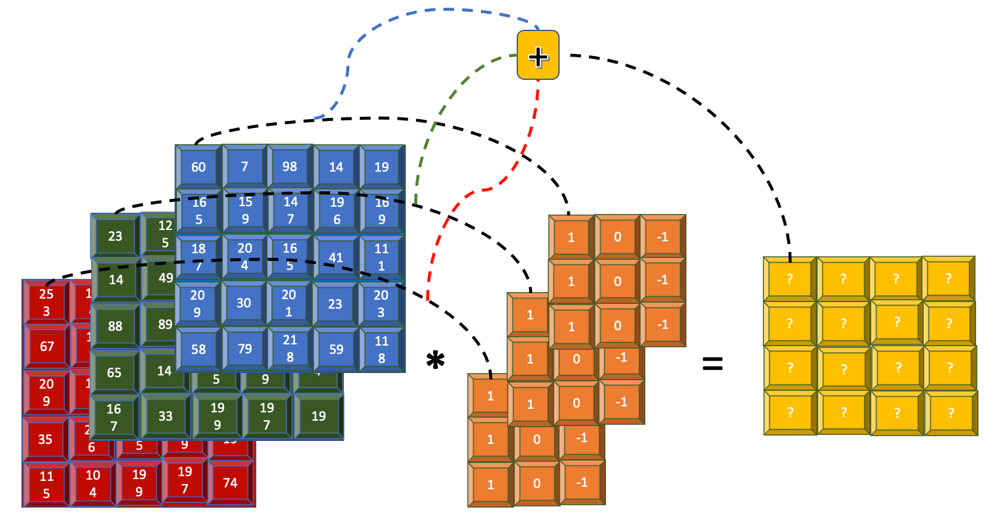

# Part 2: Understanding Convolutional Neural Networks (CNNs)

Computer vision is a field in computer science that aims to enable computers to "see" and interpret the visual world, much like humans do. Various algorithms, especially those based on machine learning and deep learning, help build models that can make predictions based on images or videos. This article focuses on **Convolutional Neural Networks (CNNs)**, a powerful type of supervised deep learning algorithm commonly used for image-related tasks.

A CNN is a specialized kind of Artificial Neural Network (ANN) designed primarily for processing grid-like data, such as images. The steps involved in building a CNN:

1.  **Image Channels:** Representing the image numerically.
2.  **Convolution:** Extracting features from the image.
3.  **Pooling:** Reducing the size and complexity of the features.
4.  **Flattening:** Preparing data for the final classification layers.
5.  **Full Connection:** Using standard neural network layers for classification.

Let's explore each step.

## 1. Image Channels

Before a CNN can process an image, the image must be converted into a numerical format. This is done using pixel values. Each pixel in an image represents a point of color and intensity.

*   **Grayscale Images:** For a black and white (grayscale) image, each pixel has a single value, typically ranging from 0 (black) to 255 (white). An image with height `m` and width `n` is represented as a 2-dimensional array (or matrix) of size `m x n`.
*   **Color Images:** Most color images use the RGB (Red, Green, Blue) model. Each pixel is represented by *three* values, one for the intensity of red, one for green, and one for blue (each usually 0-255). A color image of size `m x n` is represented as a 3-dimensional array of size `m x n x 3` (height x width x channels).

<!--  -->


The image is represented as a 3-dimensional array, with each channel representing red, green, and blue values, respectively, as shown in the following image featuring an apple.

<!--  -->


***
**Code Example: Image Channels (RGB)**

The following code snippet demonstrates how a small 3x3 pixel color image is represented as a NumPy array and how its individual Red, Green, and Blue channels can be separated:

```python
# Cell 1: Image Channels (RGB)
import numpy as np
import matplotlib.pyplot as plt

# Simulate a tiny 3x3 RGB image (values 0-255)
# Shape: (height, width, channels)
tiny_rgb_image = np.array([
    [[255, 0, 0], [0, 255, 0], [0, 0, 255]],      # Row 1: Red, Green, Blue pixels
    [[255, 255, 0], [255, 0, 255], [0, 255, 255]], # Row 2: Yellow, Magenta, Cyan
    [[255, 255, 255], [128, 128, 128], [0, 0, 0]]  # Row 3: White, Gray, Black
], dtype=np.uint8)

print("Original Image Shape (Height, Width, Channels):", tiny_rgb_image.shape)

# Extract channels (Slicing the last dimension)
red_channel = tiny_rgb_image[:, :, 0]   # Index 0
green_channel = tiny_rgb_image[:, :, 1] # Index 1
blue_channel = tiny_rgb_image[:, :, 2]  # Index 2

# Display the channels and the combined image
fig, axs = plt.subplots(1, 4, figsize=(12, 3))
axs[0].imshow(red_channel, cmap='Reds_r'); axs[0].set_title('Red Channel'); axs[0].axis('off')
axs[1].imshow(green_channel, cmap='Greens_r'); axs[1].set_title('Green Channel'); axs[1].axis('off')
axs[2].imshow(blue_channel, cmap='Blues_r'); axs[2].set_title('Blue Channel'); axs[2].axis('off')
axs[3].imshow(tiny_rgb_image); axs[3].set_title('Combined RGB'); axs[3].axis('off')
plt.tight_layout(); plt.show()

# Print the numerical values
print("\nRed Channel Values:\n", red_channel)
print("\nGreen Channel Values:\n", green_channel)
print("\nBlue Channel Values:\n", blue_channel)
```


**Visualizing RGB Channels with an Online Tool**

To get a better visual intuition of how an image is split into its Red, Green, and Blue components, you can use online tools. These tools often display each channel as a separate grayscale image, where brighter areas indicate higher intensity of that specific color in the original image. This can help solidify the concept of channels representing different color information.

For example, you can upload [an image](./img/apple.jpg) to a site like [Online Image Color Channel Separator](https://onlinetools.com/image/separate-image-color-channels) to see this separation visually.


***

## 2. Convolution


### Inspiration from the Brain: Hierarchical Vision

Before diving into the mechanics of CNNs, it's helpful to understand their inspiration: the human visual system. Our brains don't process an entire scene instantly. Instead, visual information travels through different areas of the brain, particularly the visual cortex located in the occipital lobe, processing features in a hierarchical manner.


> Image source: [Perkins School for the Blind, Adapted from Banich and Compton (2018)](https://www.perkins.org/higher-order-visual-pathways-and-the-cvi-brain/)

As shown in the illustration above:

1.  Information first hits the **Primary Visual Cortex (V1)**. Neurons here respond to simple features like edges, lines, and orientations.
2.  This output is passed to subsequent areas like **V2** and **V3**. Neurons in these areas combine the simple features detected in V1 to recognize more complex shapes, corners, and textures.
3.  Further processing in higher-level areas (like the Inferior Temporal Cortex, not fully detailed here) combines these shapes to recognize complex objects (like faces, chairs, or the apple from our earlier example).

**The Connection to CNNs:**

Convolutional Neural Networks are designed to mimic this hierarchical feature learning. The **Convolutional layers** in a CNN act similarly to these stages in the visual cortex:

*   **Early convolutional layers** (closer to the input image) automatically learn to detect simple features like edges and corners.
*   **Deeper convolutional layers** (further into the network) receive input from earlier layers and learn to combine those simple features to detect more complex patterns, textures, parts of objects, and eventually entire objects.

This biological inspiration helps explain why CNNs are structured with multiple layers and why convolution is such a fundamental operation for image understanding. Now, let's look at how the convolution operation actually achieves this feature extraction.

### CNN

**Purpose:** Now that the image is represented numerically, the next step is to identify important visual features within it. Convolution is the core operation CNNs use for this feature extraction (e.g., finding edges, corners, textures).

Think of convolution like sliding a small specialized magnifying glass over the image. This "magnifying glass" is called a **filter** or **kernel**, and it's designed to detect a specific pattern. When the filter is over a part of the image that matches its pattern, it produces a strong signal (high value); otherwise, the signal is weak (low value). This process creates an output map, called a **feature map**, which highlights where the specific feature appears in the original image.

**Important Note:** While we often use simple, predefined filters (like edge detectors) for explanation, a key strength of CNNs is that they *learn* the optimal filter values during the training process based on the task (e.g., classifying cats vs. dogs).

### How Features are Detected

To extract features, we use a filter (kernel). The filter slides across the input image's numerical array. At each position, the filter's values are multiplied element-wise with the underlying patch of the image, and the results are summed up to produce a single value in the feature map.


For simplicity, the following animation shows how an edge detector filter might be applied to just one channel (e.g., the blue channel) of an image. The resulting feature map highlights the edges found.

<!--  -->


The filter used in the animation is size `3x3` applied to an input of size `5x5`. The resulting feature map is size `3x3`. In summary, for an input image of size `n x n` and a filter of size `m x m` (with stride 1, no padding), the resulting output is of size `(n - m + 1) x (n - m + 1)`.

***
**Code Example: Feature Detection (Single Filter Convolution)**

This code applies a 3x3 vertical edge detection filter to a 5x5 single-channel input, producing a 3x3 feature map.

<details>
<summary>Step 1/9: Setup (Loading a Real Image)</summary>

Let's load a real image from the web. We'll use a picture of a Pigeon. We will load it, convert it to RGB (just in case it's [RGBA](https://www.w3schools.com/Css/css_colors_rgb.asp) or other), resize it slightly for faster processing, and also create a grayscale version for single-channel demonstrations.

```python
# Cell 1.5: Setup - Load and Prepare a Real Image
import numpy as np
import matplotlib.pyplot as plt
from PIL import Image
import requests
from io import BytesIO
from scipy.signal import convolve2d

# --- Image Loading ---
try:
    # Example image URL (Wikimedia Commons - Bicycle) - Check license if using elsewhere!
    #image_url = "https://upload.wikimedia.org/wikipedia/commons/thumb/4/41/Left_side_of_Flying_Pigeon.jpg/640px-Left_side_of_Flying_Pigeon.jpg" # Option 1
    image_url = "https://raw.githubusercontent.com/ML-Course-2025/session6/refs/heads/main/material/img/640px-Left_side_of_Flying_Pigeon.jpg" # Option 2

    response = requests.get(image_url)
    response.raise_for_status() # Raise an exception for bad status codes
    img_pil = Image.open(BytesIO(response.content)).convert('RGB')

    # Resize for faster processing (optional, maintains aspect ratio)
    img_pil.thumbnail((256, 256)) # Max size 256x256

    # Convert to NumPy arrays
    img_rgb = np.array(img_pil).astype(np.float32) / 255.0 # Normalize to 0.0-1.0
    img_gray = np.array(img_pil.convert('L')).astype(np.float32) / 255.0 # Grayscale version, normalized

    print(f"Image loaded successfully.")
    print(f"Original Color Image Shape (H, W, C): {img_rgb.shape}")
    print(f"Grayscale Image Shape (H, W): {img_gray.shape}")

    # Display loaded images
    plt.figure(figsize=(8, 4))
    plt.subplot(1, 2, 1)
    plt.imshow(img_rgb)
    plt.title("Original Color Image")
    plt.axis('off')
    plt.subplot(1, 2, 2)
    plt.imshow(img_gray, cmap='gray')
    plt.title("Grayscale Version")
    plt.axis('off')
    plt.tight_layout()
    plt.show()

except requests.exceptions.RequestException as e:
    print(f"Error loading image from URL: {e}")
    # Use placeholder arrays if image loading fails
    img_rgb = np.random.rand(100, 100, 3)
    img_gray = np.random.rand(100, 100)
    print("Using random noise array as fallback.")
except Exception as e:
     print(f"An error occurred: {e}")
     img_rgb = np.random.rand(100, 100, 3)
     img_gray = np.random.rand(100, 100)
     print("Using random noise array as fallback.")


# --- Define Filters (We'll reuse these) ---
# Vertical Edge Detection
filter_vertical = np.array([
    [ 1, 0, -1],
    [ 2, 0, -2],
    [ 1, 0, -1]
], dtype=np.float32)

# Horizontal Edge Detection
filter_horizontal = np.array([
    [ 1,  2,  1],
    [ 0,  0,  0],
    [-1, -2, -1]
], dtype=np.float32)

# Sharpen Filter
filter_sharpen = np.array([
    [ 0, -1,  0],
    [-1,  5, -1],
    [ 0, -1,  0]
], dtype=np.float32)
```
</details>

<details>
<summary>Step 2/9: How Features are Detected (Convolution with one filter on Real Image)</summary>

```python
# Cell 2: How Features are Detected (Convolution with one filter on Real Image)

# Check if image loading was successful
if 'img_gray' not in globals():
    print("Grayscale image not loaded. Please run the setup cell first.")
else:
    # Use the grayscale image and the vertical edge filter
    input_image = img_gray
    filter_kernel = filter_vertical

    print("Input Image Shape:", input_image.shape)
    print("Filter Kernel Shape:", filter_kernel.shape)

    # Apply convolution (mode='valid' means no padding)
    # Flip kernel for strict convolution definition
    feature_map = convolve2d(input_image, np.flipud(np.fliplr(filter_kernel)), mode='valid')
    output_shape = feature_map.shape
    print(f"Feature Map Shape: {output_shape}")

    # Display
    plt.figure(figsize=(12, 4))
    plt.subplot(1, 3, 1)
    plt.imshow(input_image, cmap='gray')
    plt.title(f'Input Grayscale ({input_image.shape[0]}x{input_image.shape[1]})')
    plt.axis('off')

    plt.subplot(1, 3, 2)
    plt.imshow(filter_kernel, cmap='coolwarm')
    plt.title(f'Filter Kernel ({filter_kernel.shape[0]}x{filter_kernel.shape[1]})')
    plt.axis('off')

    plt.subplot(1, 3, 3)
    # Display absolute value or clip for better visualization of edges
    plt.imshow(np.abs(feature_map), cmap='gray')
    plt.title(f'Feature Map ({output_shape[0]}x{output_shape[1]})\n(Vertical Edges Enhanced)')
    plt.axis('off')

    plt.tight_layout()
    plt.show()
```
</details>

<!-- 
```python
# Cell 2: How Features are Detected (Convolution with one filter)
from scipy.signal import convolve2d # Use SciPy for a standard convolution function

# Simple 5x5 grayscale input image (simulating a right edge/corner)
input_image = np.array([
    [10, 10, 10, 10, 10], [10, 10, 10, 10, 10], [10, 10, 200, 200, 200],
    [10, 10, 200, 200, 200], [10, 10, 200, 200, 200]
], dtype=np.float32)

# Simple 3x3 filter (detects vertical edges)
filter_kernel = np.array([[ 1, 0, -1], [ 2, 0, -2], [ 1, 0, -1]], dtype=np.float32)

print("Input Image (5x5):\n", input_image)
print("\nFilter Kernel (3x3):\n", filter_kernel)

# Apply convolution using 'valid' mode (no padding)
# We flip kernel for strict convolution definition used by convolve2d
feature_map = convolve2d(input_image, np.flipud(np.fliplr(filter_kernel)), mode='valid')

print(f"\nFeature Map (Output - Shape {feature_map.shape}):\n", feature_map)

# Display
fig, axs = plt.subplots(1, 3, figsize=(9, 3))
axs[0].imshow(input_image, cmap='gray', vmin=0, vmax=255); axs[0].set_title('Input Image (5x5)'); axs[0].axis('off')
axs[1].imshow(filter_kernel, cmap='coolwarm', vmin=-4, vmax=4); axs[1].set_title('Filter Kernel (3x3)'); axs[1].axis('off')
axs[2].imshow(feature_map, cmap='gray'); axs[2].set_title(f'Feature Map ({feature_map.shape[0]}x{feature_map.shape[1]})'); axs[2].axis('off')
plt.tight_layout(); plt.show()
``` -->

**Other Examples:**


***

### Strided Convolutions

**Purpose:** Striding allows the filter to skip pixels as it slides across the input image, effectively downsampling the output. This reduces the size of the resulting feature map more significantly and speeds up computation.

**Process:** Instead of moving one pixel at a time (stride=1), the filter can jump, for example, 2 pixels (stride=2) horizontally and vertically.

The following animation shows the same convolution as before, but with a stride of 2 steps.

<!--  -->


The `3x3` filter applied to the `5x5` input with `stride=2` results in a `2x2` feature map. In summary, for an input `n x n`, filter `m x m`, and stride `k`, the output size is `floor((n - m) / k + 1) x floor((n - m) / k + 1)`.

***
**Code Example: Strided Convolution**

This code demonstrates convolution with `stride=3`.

```python
# Cell 3: Striding on Real Image

# Check if image loading was successful
if 'img_gray' not in globals():
    print("Grayscale image not loaded. Please run the setup cell first.")
else:
    # Use grayscale image and horizontal edge filter this time
    input_image = img_gray
    filter_kernel = filter_horizontal # Let's use the horizontal one here

    # Manual convolution calculation with stride = 3 (more noticeable reduction)
    stride = 3
    input_h, input_w = input_image.shape
    filter_h, filter_w = filter_kernel.shape
    # Calculate output dimensions
    output_h = int(np.floor((input_h - filter_h) / stride)) + 1
    output_w = int(np.floor((input_w - filter_w) / stride)) + 1
    feature_map_strided = np.zeros((output_h, output_w), dtype=np.float32)

    # Perform the convolution manually stepping by 'stride'
    for i in range(output_h):
        for j in range(output_w):
            start_row, start_col = i * stride, j * stride
            patch = input_image[start_row : start_row + filter_h, start_col : start_col + filter_w]
            # Ensure patch dimensions match filter if near edge with stride
            if patch.shape == filter_kernel.shape:
                 feature_map_strided[i, j] = np.sum(patch * filter_kernel)

    print(f"Input Shape: {input_image.shape}, Filter Shape: {filter_kernel.shape}")
    print(f"Output Feature Map with Stride={stride} Shape: ({output_h}x{output_w})")

    # Display
    plt.figure(figsize=(12, 4))
    plt.subplot(1, 3, 1)
    plt.imshow(input_image, cmap='gray')
    plt.title(f'Input Grayscale ({input_image.shape[0]}x{input_image.shape[1]})')
    plt.axis('off')

    plt.subplot(1, 3, 2)
    plt.imshow(filter_kernel, cmap='coolwarm')
    plt.title(f'Filter Kernel ({filter_kernel.shape[0]}x{filter_kernel.shape[1]})')
    plt.axis('off')

    plt.subplot(1, 3, 3)
    plt.imshow(np.abs(feature_map_strided), cmap='gray')
    plt.title(f'Feature Map (Stride={stride}, {output_h}x{output_w})\n(Horizontal Edges)')
    plt.axis('off')

    plt.tight_layout()
    plt.show()
```

<!-- 
```python
# Cell 3: Striding
# Re-use input and filter from previous example
input_image = np.array([
    [10, 10, 10, 10, 10], [10, 10, 10, 10, 10], [10, 10, 200, 200, 200],
    [10, 10, 200, 200, 200], [10, 10, 200, 200, 200]
], dtype=np.float32)
filter_kernel = np.array([[ 1, 0, -1], [ 2, 0, -2], [ 1, 0, -1]], dtype=np.float32)

# Manual convolution calculation with stride = 2
stride = 2
input_h, input_w = input_image.shape
filter_h, filter_w = filter_kernel.shape
output_h = int(np.floor((input_h - filter_h) / stride)) + 1
output_w = int(np.floor((input_w - filter_w) / stride)) + 1
feature_map_strided = np.zeros((output_h, output_w), dtype=np.float32)

for i in range(output_h):
    for j in range(output_w):
        patch = input_image[i*stride : i*stride + filter_h, j*stride : j*stride + filter_w]
        feature_map_strided[i, j] = np.sum(patch * filter_kernel)

print("Input Image (5x5):\n", input_image)
print("\nFilter Kernel (3x3):\n", filter_kernel)
print(f"\nFeature Map with Stride={stride} (Output - {output_h}x{output_w}):\n", feature_map_strided)

# Display
fig, axs = plt.subplots(1, 3, figsize=(9, 3))
axs[0].imshow(input_image, cmap='gray', vmin=0, vmax=255); axs[0].set_title('Input Image (5x5)'); axs[0].axis('off')
axs[1].imshow(filter_kernel, cmap='coolwarm', vmin=-4, vmax=4); axs[1].set_title('Filter Kernel (3x3)'); axs[1].axis('off')
axs[2].imshow(feature_map_strided, cmap='gray'); axs[2].set_title(f'Feature Map (Stride={stride}, {output_h}x{output_w})'); axs[2].axis('off')
plt.tight_layout(); plt.show()
``` -->
***

### Padding

**Purpose:** Convolution (especially without stride) reduces the spatial dimensions of the feature map. Also, pixels near the border of the image are processed fewer times by the filter than pixels in the center. **Padding** addresses these issues by:
1.  Allowing control over the output feature map size (e.g., keeping it the same as the input using "same" padding).
2.  Ensuring pixels at the edges and corners are processed more thoroughly by the filter.

**Process:** Padding involves adding extra rows and columns of zeros (usually) around the border of the input image *before* applying the convolution.

The following animation shows how 1 layer of zero-padding is added to the input array before the filter is applied.

<!--  -->


With one layer of padding (`p=1`), the `5x5` input becomes `7x7`. Applying a `3x3` filter (`m=3`) with `stride=1` then results in a `5x5` output, preserving the original spatial dimensions. In general, for input `n x n`, filter `m x m`, padding `p`, and stride `k=1`, the output size is `(n + 2p - m + 1) x (n + 2p - m + 1)`.

***
**Code Example: Padding**

This code adds `padding=1` before convolution to maintain the output size.

```python
# Cell 4: Padding on Real Image

# Check if image loading was successful
if 'img_gray' not in globals():
    print("Grayscale image not loaded. Please run the setup cell first.")
else:
    # Use grayscale image and the sharpen filter
    input_image = img_gray
    filter_kernel = filter_sharpen

    # Add padding (p=1 layer of zeros)
    padding = 1
    padded_image = np.pad(input_image, pad_width=((padding, padding), (padding, padding)), mode='constant', constant_values=0)

    print(f"Original Input Shape: {input_image.shape}")
    print(f"Padded Image Shape: {padded_image.shape}")

    # Apply convolution (stride=1) to the *padded* image using 'valid' mode
    feature_map_padded = convolve2d(padded_image, np.flipud(np.fliplr(filter_kernel)), mode='valid')
    output_shape = feature_map_padded.shape
    print(f"Output Feature Map Shape after Padding: {output_shape}")
    # Note: Output size = (Input_Padded - Filter + 1) should be same as Original Input

    # Display
    plt.figure(figsize=(12, 4))
    plt.subplot(1, 3, 1)
    plt.imshow(padded_image, cmap='gray')
    plt.title(f'Padded Input ({padded_image.shape[0]}x{padded_image.shape[1]})')
    plt.axis('off')

    plt.subplot(1, 3, 2)
    plt.imshow(filter_kernel, cmap='coolwarm', vmin=-1.1, vmax=5.1) # Adjust vmin/vmax for sharpen filter
    plt.title(f'Filter Kernel ({filter_kernel.shape[0]}x{filter_kernel.shape[1]})')
    plt.axis('off')

    plt.subplot(1, 3, 3)
    # Clip values to 0-1 range for display after sharpening
    plt.imshow(np.clip(feature_map_padded, 0, 1), cmap='gray')
    plt.title(f'Feature Map ({output_shape[0]}x{output_shape[1]})\n(Sharpened)')
    plt.axis('off')

    plt.tight_layout()
    plt.show()
```
<!-- 
```python
# Cell 4: Padding
# Re-use input and filter
input_image = np.array([
    [10, 10, 10, 10, 10], [10, 10, 10, 10, 10], [10, 10, 200, 200, 200],
    [10, 10, 200, 200, 200], [10, 10, 200, 200, 200]
], dtype=np.float32)
filter_kernel = np.array([[ 1, 0, -1], [ 2, 0, -2], [ 1, 0, -1]], dtype=np.float32)

# Add padding (p=1 layer of zeros)
padding = 1
padded_image = np.pad(input_image, pad_width=((padding, padding), (padding, padding)), mode='constant', constant_values=0)

print("Original Input Image (5x5):\n", input_image)
print(f"\nPadded Image ({padded_image.shape[0]}x{padded_image.shape[1]}):\n", padded_image)

# Apply convolution (stride=1) to the *padded* image using 'valid' mode
feature_map_padded = convolve2d(padded_image, np.flipud(np.fliplr(filter_kernel)), mode='valid')

print("\nFilter Kernel (3x3):\n", filter_kernel)
print(f"\nFeature Map after Padding (Output - {feature_map_padded.shape}):\n", feature_map_padded) # Output is 5x5

# Display
fig, axs = plt.subplots(1, 3, figsize=(9, 3))
axs[0].imshow(padded_image, cmap='gray', vmin=0, vmax=255); axs[0].set_title(f'Padded Input ({padded_image.shape[0]}x{padded_image.shape[1]})'); axs[0].axis('off')
axs[1].imshow(filter_kernel, cmap='coolwarm', vmin=-4, vmax=4); axs[1].set_title('Filter Kernel (3x3)'); axs[1].axis('off')
axs[2].imshow(feature_map_padded, cmap='gray'); axs[2].set_title(f'Feature Map ({feature_map_padded.shape[0]}x{feature_map_padded.shape[1]})'); axs[2].axis('off')
plt.tight_layout(); plt.show()
``` 
-->
***

### How Convolutions Apply over RGB Channels

**Process:** When dealing with color images (e.g., 3 channels: R, G, B), the convolution filter must also have the same number of channels (depth). So, if the input is `n x n x 3`, a `m x m` filter will actually be `m x m x 3`.

The 3D filter slides over the 3D input patch. The element-wise multiplication and summation happens across *all three channels simultaneously*. The crucial point is that all these results (from R, G, and B interactions with their respective filter channels) are summed up into a *single* number for that position in the output feature map. Therefore, even with a 3-channel input and a 3-channel filter, the resulting feature map is still **2-dimensional**.

<!--  -->


For a `5x5` image represented over 3 channels (`5x5x3` array), a `3x3` filter (represented as a `3x3x3` array) produces a single `4x4` feature map (assuming stride=1, no padding: `(5-3+1) = 3+1 = 4`).

***
**Code Example: Convolution over RGB Channels**

This code applies one 3x3x3 filter to a 5x5x3 input, producing a single 3x3 feature map (using stride=1 and 'valid'/no padding for simplicity).

```python
# Cell 5: How Convolutions are Applied over RGB Channels (Real Image)

# Check if image loading was successful
if 'img_rgb' not in globals():
    print("Color image not loaded. Please run the setup cell first.")
else:
    # Use the COLOR image (H, W, C)
    input_rgb = img_rgb

    # Create a 3x3x3 filter - e.g., detect vertical edges strongly in Red, ignore Green, weakly in Blue
    filter_rgb_single = np.zeros((3, 3, 3), dtype=np.float32)
    filter_rgb_single[:, :, 0] = filter_vertical # Strong vertical edge in Red (Ch 0)
    filter_rgb_single[:, :, 1] = 0               # Ignore Green (Ch 1)
    filter_rgb_single[:, :, 2] = filter_vertical * 0.5 # Weak vertical edge in Blue (Ch 2)

    print("Input RGB Image Shape (H, W, C):", input_rgb.shape)
    print("Filter RGB Shape (H, W, C):", filter_rgb_single.shape)

    # Manual convolution (stride=1, no padding)
    stride = 1
    input_h, input_w, input_c = input_rgb.shape
    filter_h, filter_w, filter_c = filter_rgb_single.shape
    output_h = ((input_h - filter_h) // stride) + 1
    output_w = ((input_w - filter_w) // stride) + 1
    feature_map_rgb_combined = np.zeros((output_h, output_w), dtype=np.float32)

    for i in range(output_h):
        for j in range(output_w):
            patch = input_rgb[i*stride : i*stride + filter_h, j*stride : j*stride + filter_w, :]
            if patch.shape == filter_rgb_single.shape:
                activation = np.sum(patch * filter_rgb_single) # Sum over all H*W*C elements
                feature_map_rgb_combined[i, j] = activation

    print(f"Combined Feature Map Shape (Output is 2D): {feature_map_rgb_combined.shape}")

    # Display (Input R channel, Filter R channel, combined output map)
    plt.figure(figsize=(12, 4))
    plt.subplot(1, 3, 1)
    plt.imshow(input_rgb[:,:,0], cmap='Reds_r') # Show R channel of input
    plt.title('Input (Red Ch.)')
    plt.axis('off')

    plt.subplot(1, 3, 2)
    plt.imshow(filter_rgb_single[:,:,0], cmap='coolwarm') # Show R channel of filter
    plt.title('Filter (Red Ch.)')
    plt.axis('off')

    plt.subplot(1, 3, 3)
    plt.imshow(np.abs(feature_map_rgb_combined), cmap='gray') # Show absolute value
    plt.title(f'Combined Output Map ({output_h}x{output_w})\n(Color Filter Applied)')
    plt.axis('off')

    plt.tight_layout()
    plt.show()
```
<!-- 
```python
# Cell 5: How Convolutions are Applied over RGB Channels
# Simulate a 5x5x3 RGB input image
input_rgb = np.zeros((5, 5, 3), dtype=np.float32)
input_rgb[2:, 2:, 0] = 200 # Red corner (Ch 0)
input_rgb[1:4, 1:4, 1] = 150 # Green square (Ch 1)
input_rgb[:3, :3, 2] = 100 # Blue corner (Ch 2)

# Simulate a 3x3x3 filter
filter_rgb = np.zeros((3, 3, 3), dtype=np.float32)
filter_rgb[:, :, 0] = np.array([[1, 0, -1], [2, 0, -2], [1, 0, -1]]) # Vertical edge in Red
filter_rgb[:, :, 1] = 0 # Ignore Green
filter_rgb[:, :, 2] = np.array([[0, 0, 0], [0, 1, 0], [0, 0, 0]]) * 0.5 # Faint center detector in Blue

print("Input RGB Image Shape (H, W, C):", input_rgb.shape)
print("Filter RGB Shape (H, W, C):", filter_rgb.shape)

# Apply convolution (manual calculation, stride=1, no padding)
stride = 1
input_h, input_w, input_c = input_rgb.shape
filter_h, filter_w, filter_c = filter_rgb.shape
output_h = ((input_h - filter_h) // stride) + 1 # (5-3)//1 + 1 = 3
output_w = ((input_w - filter_w) // stride) + 1 # (5-3)//1 + 1 = 3
feature_map_rgb_combined = np.zeros((output_h, output_w), dtype=np.float32)

for i in range(output_h):
    for j in range(output_w):
        patch = input_rgb[i*stride : i*stride + filter_h, j*stride : j*stride + filter_w, :]
        activation = np.sum(patch * filter_rgb) # Sum over all H*W*C elements
        feature_map_rgb_combined[i, j] = activation

print(f"\nCombined Feature Map (Output Shape {feature_map_rgb_combined.shape}):\n", feature_map_rgb_combined)

# Display
fig, axs = plt.subplots(1, 3, figsize=(9, 3))
axs[0].imshow(input_rgb[:,:,0], cmap='gray', vmin=0, vmax=255); axs[0].set_title('Input (R Ch.)'); axs[0].axis('off')
axs[1].imshow(filter_rgb[:,:,0], cmap='coolwarm', vmin=-4, vmax=4); axs[1].set_title('Filter (R Ch.)'); axs[1].axis('off')
axs[2].imshow(feature_map_rgb_combined, cmap='gray'); axs[2].set_title(f'Combined Output Map ({output_h}x{output_w})'); axs[2].axis('off')
plt.tight_layout(); plt.show()
``` 
-->
***

### How Convolutions Apply with More Than One Filter

**Purpose:** A single filter detects only one feature type. CNNs use *multiple* filters in the same convolutional layer to learn a richer set of features simultaneously (e.g., vertical edges, horizontal edges, curves, textures).

**Process:** If a convolutional layer has `F` filters, each filter (size `m x m x C`) is applied independently to the input (`n x n x C`). This generates `F` separate 2D feature maps. These maps are then stacked together along the depth dimension, creating a final output volume of size `(n-m+1) x (n-m+1) x F` (assuming stride=1, no padding).

<!--  -->


The image shows applying three different filters to the RGB input. Each filter produces its own 2D feature map (size `4x4` in the example). Stacking these results produces a `4x4x3` output volume.

***
**Code Example: Convolution with Multiple Filters**

This code applies two different 3x3x3 filters to the 5x5x3 input, resulting in a 3x3x2 output volume (using stride=1, 'valid'/no padding).

```python
# Cell 6: How Convolutions are Applied with More Than One Filter (Real Image)

# Check if image loading was successful
if 'img_rgb' not in globals():
    print("Color image not loaded. Please run the setup cell first.")
else:
    # Use the COLOR image
    input_rgb = img_rgb

    # Define TWO different 3x3x3 filters
    # Filter 1: Vertical Edge detector (strong on Red, weak on Blue)
    filter_1_rgb = np.zeros((3, 3, 3), dtype=np.float32)
    filter_1_rgb[:, :, 0] = filter_vertical * 1.0
    filter_1_rgb[:, :, 2] = filter_vertical * 0.5

    # Filter 2: Horizontal Edge detector (strong on Green)
    filter_2_rgb = np.zeros((3, 3, 3), dtype=np.float32)
    filter_2_rgb[:, :, 1] = filter_horizontal * 1.0

    filters_list = [filter_1_rgb, filter_2_rgb]
    num_filters = len(filters_list)

    print("Input RGB Image Shape (H, W, C):", input_rgb.shape)
    print("Number of Filters:", num_filters)

    # Apply each filter (stride=1, no padding)
    stride = 1
    input_h, input_w, input_c = input_rgb.shape
    filter_h, filter_w, filter_c = filters_list[0].shape
    output_h = ((input_h - filter_h) // stride) + 1
    output_w = ((input_w - filter_w) // stride) + 1
    # Output will have shape (H, W, NumFilters)
    output_feature_maps = np.zeros((output_h, output_w, num_filters), dtype=np.float32)

    for f_idx, current_filter in enumerate(filters_list):
        for i in range(output_h):
            for j in range(output_w):
                patch = input_rgb[i*stride : i*stride + filter_h, j*stride : j*stride + filter_w, :]
                if patch.shape == current_filter.shape:
                     activation = np.sum(patch * current_filter)
                     output_feature_maps[i, j, f_idx] = activation

    print(f"Stacked Output Feature Maps Shape (H, W, NumFilters): {output_feature_maps.shape}")

    # Display the input R channel and the two resulting feature maps
    plt.figure(figsize=(12, 4))
    plt.subplot(1, 1 + num_filters, 1)
    plt.imshow(input_rgb[:,:,0], cmap='Reds_r') # Show R channel of input
    plt.title('Input (Red Ch.)')
    plt.axis('off')

    # Display each feature map
    for f_idx in range(num_filters):
        plt.subplot(1, 1 + num_filters, f_idx + 2)
        plt.imshow(np.abs(output_feature_maps[:, :, f_idx]), cmap='gray')
        plt.title(f'Output Map {f_idx+1}')
        plt.axis('off')

    plt.tight_layout()
    plt.show()
```
<!-- 
```python
# Cell 6: How Convolutions are Applied with More Than One Filter
# Use the same 5x5x3 RGB input image
input_rgb = np.zeros((5, 5, 3), dtype=np.float32)
input_rgb[2:, 2:, 0] = 200; input_rgb[1:4, 1:4, 1] = 150; input_rgb[:3, :3, 2] = 100

# Define TWO different 3x3x3 filters
filter_1 = np.zeros((3, 3, 3), dtype=np.float32); filter_1[:, :, 0] = np.array([[1, 0, -1], [2, 0, -2], [1, 0, -1]]); filter_1[:, :, 1] = 0.1; filter_1[:, :, 2] = -0.1
filter_2 = np.zeros((3, 3, 3), dtype=np.float32); filter_2[:, :, 0] = -0.1; filter_2[:, :, 1] = 0.1; filter_2[:, :, 2] = np.array([[1, 2, 1], [0, 0, 0], [-1, -2, -1]])

filters = [filter_1, filter_2]
num_filters = len(filters)

print("Input RGB Image Shape (H, W, C):", input_rgb.shape)
print("Number of Filters:", num_filters)

# Apply each filter (stride=1, no padding)
stride = 1
input_h, input_w, input_c = input_rgb.shape; filter_h, filter_w, filter_c = filters[0].shape
output_h = ((input_h - filter_h) // stride) + 1; output_w = ((input_w - filter_w) // stride) + 1
output_feature_maps = np.zeros((output_h, output_w, num_filters), dtype=np.float32) # H x W x NumFilters

for f_idx, current_filter in enumerate(filters):
    for i in range(output_h):
        for j in range(output_w):
            patch = input_rgb[i*stride : i*stride + filter_h, j*stride : j*stride + filter_w, :]
            activation = np.sum(patch * current_filter)
            output_feature_maps[i, j, f_idx] = activation

print(f"\nStacked Output Feature Maps Shape (H, W, NumFilters): {output_feature_maps.shape}") # 3x3x2

# Display
fig, axs = plt.subplots(1, 1 + num_filters, figsize=(9, 3))
axs[0].imshow(input_rgb[:,:,0], cmap='gray', vmin=0, vmax=255); axs[0].set_title('Input (R Ch.)'); axs[0].axis('off')
for f_idx in range(num_filters):
    axs[f_idx+1].imshow(output_feature_maps[:, :, f_idx], cmap='gray'); axs[f_idx+1].set_title(f'Output Map {f_idx+1}'); axs[f_idx+1].axis('off')
plt.tight_layout(); plt.show()
``` 
-->
***

## 3. Pooling Layers

**Purpose:** After convolution extracts features, pooling layers (also called subsampling layers) reduce the spatial dimensions (width and height) of the feature maps. This:
1.  Reduces the amount of computation and parameters.
2.  Helps make features more robust to small variations in their exact location (achieving some "translation invariance").

**Process:** Pooling operates on each feature map independently. A window slides over the feature map (often non-overlapping, e.g., 2x2 window with stride 2), and a summary statistic is computed. Common types are:
*   **Average Pooling:** Takes the average value within the window.
*   **Max Pooling:** Takes the maximum value within the window (most common).


The following animation shows Max Pooling with a 2x2 window and stride 2 (implied by non-overlapping movement). For every 2x2 group of cells, the maximum value is selected for the output. (Note: *the animation is not quite accurate*)

<!--  -->


Note that pooling is applied independently to each feature map generated by the preceding convolutional layer.

***
**Code Example: Max Pooling**

This code demonstrates Max Pooling with a 2x2 window and stride=2 on a 4x4 feature map, resulting in a 2x2 output.

```python
# Cell 7: Pooling Layers (Max Pooling)
# Example 4x4 feature map
feature_map = np.array([
    [12, 20, 30,  0], [ 8, 18,  2, 25], [15,  5, 22, 19], [21, 10,  9, 31]
], dtype=np.float32)
print("Original Feature Map (4x4):\n", feature_map)

# Apply Max Pooling (2x2 window, stride=2)
pool_size = 2; stride = 2
map_h, map_w = feature_map.shape
output_h = int(np.floor((map_h - pool_size) / stride)) + 1 # (4-2)/2 + 1 = 2
output_w = int(np.floor((map_w - pool_size) / stride)) + 1 # (4-2)/2 + 1 = 2
pooled_map = np.zeros((output_h, output_w), dtype=np.float32)

for i in range(output_h):
    for j in range(output_w):
        patch = feature_map[i*stride : i*stride + pool_size, j*stride : j*stride + pool_size]
        pooled_map[i, j] = np.max(patch)

print(f"\nMax Pooled Map ({output_h}x{output_w}):\n", pooled_map)

# Display
fig, axs = plt.subplots(1, 2, figsize=(7, 3.5))
def plot_matrix_pooling(ax, data, title): # Helper to show values
    im = ax.imshow(data, cmap='viridis'); ax.set_title(title)
    for r in range(data.shape[0]):
        for c in range(data.shape[1]):
            ax.text(c, r, f"{data[r, c]:.0f}", ha='center', va='center', color='white' if data[r,c] < 15 else 'black')
    fig.colorbar(im, ax=ax, fraction=0.046, pad=0.04)

plot_matrix_pooling(axs[0], feature_map, 'Original Feature Map (4x4)')
plot_matrix_pooling(axs[1], pooled_map, f'Max Pooled ({output_h}x{output_w})')
plt.tight_layout(); plt.show()
```


***

## 4. Flattening

**Purpose:** The convolutional and pooling layers output multi-dimensional feature maps (e.g., `Height x Width x Channels`). Standard Artificial Neural Network layers (Fully Connected/Dense layers), used for the final classification, expect their input as a single, flat **1-dimensional vector**. Flattening converts the multi-dimensional output into this required 1D format.

**Process:** Flattening simply takes all the elements in the multi-dimensional array and arranges them sequentially into one long vector.

<!--  -->


The animation shows the transformation of the pooled feature maps (a 3D volume) into a single column (a 1D vector). Note that in practice, flattening is applied to the entire volume of feature maps resulting from the last conv/pool layer.

***
**Code Example: Flattening**

This code flattens a small 2x2x2 volume into a 1D vector of length 8.

```python
# Cell 8: Flattening
# Example 2x2x2 volume (e.g., output from pooling 2 feature maps)
pooled_output_multi_filter = np.array([
    [[40, 55], [75, 65]], # H=0, W=0, C=0,1 | H=0, W=1, C=0,1
    [[90, 85], [95, 70]]  # H=1, W=0, C=0,1 | H=1, W=1, C=0,1
], dtype=np.float32) # Shape is (H, W, C) = (2, 2, 2)

print("Input to Flattening (Pooled Feature Maps):")
print("Shape (H, W, C):", pooled_output_multi_filter.shape)
print("Data:\n", pooled_output_multi_filter)

# Flatten the 3D array into a 1D vector (C-style order: last axis changes fastest)
flattened_vector = pooled_output_multi_filter.flatten(order='C')

print("\nFlattened Vector:")
print("Shape:", flattened_vector.shape) # (2*2*2,) = (8,)
print("Data:", flattened_vector) # Order: (0,0,0), (0,0,1), (0,1,0), (0,1,1), (1,0,0), ...

# Visualization
plt.figure(figsize=(8, 3))
plt.subplot(1, 2, 1); plt.imshow(pooled_output_multi_filter[:, :, 0], cmap='gray'); plt.title(f'Pre-Flatten (Slice 0)\nShape {pooled_output_multi_filter.shape}'); plt.axis('off')
for r in range(2):
    for c in range(2): plt.text(c, r, f'{pooled_output_multi_filter[r, c, 0]:.0f}', ha='center', va='center', color='white')
plt.subplot(1, 2, 2); plt.stem(flattened_vector); plt.title(f'Flattened Vector\nShape {flattened_vector.shape}')
plt.xticks(np.arange(len(flattened_vector))); plt.grid(True, axis='y'); plt.xlabel('Index'); plt.ylabel('Value')
plt.tight_layout(); plt.show()
```
***

## 5. Full Connection: A Simple Convolutional Network

**Purpose:** This is the final stage where the network performs classification. The flattened vector, containing extracted features, is fed into one or more standard **Fully Connected (Dense)** layers, similar to those in a basic ANN. These layers learn to combine the features to make a final prediction.

**Process:** The flattened vector is the input to the first Dense layer. Each neuron connects to all neurons in the previous layer. The last Dense layer typically has neurons equal to the number of classes (e.g., 10 for digits 0-9) and uses an activation like **Softmax** to output class probabilities.

A typical CNN architecture repeats Convolution and Pooling steps (Conv -> Pool -> Conv -> Pool -> ...) before Flattening and passing to the Fully Connected layers. The exact number of layers and their parameters depend on the specific task.

<!--  -->


The image above illustrates the end-to-end flow: an input image goes through Convolution and Pooling layers (possibly multiple times), the result is Flattened into a vector, and this vector feeds into Fully Connected (Dense) layers for final classification (e.g., predicting "apple").

***
**Code Example: Simplified CNN Flow (Conceptual)**

This code shows the conceptual flow from a tiny input through simplified Conv, ReLU, Pool, and Flatten steps, yielding the vector ready for the Dense layers.

```python
# Cell 9: Full Connection (Simplified Conceptual Flow - Steps before Dense layers)
# --- Simulate Steps on a Tiny Example ---
input_simple = np.array([[0, 0, 0, 0],[0, 200, 200, 0],[0, 200, 200, 0],[0, 0, 0, 0]], dtype=np.float32) # 1. Input
kernel_simple = np.array([[0, 1, 0],[1, -4, 1],[0, 1, 0]], dtype=np.float32) # Laplacian filter
convolved_simple = convolve2d(input_simple, np.flipud(np.fliplr(kernel_simple)), mode='valid') # 2. Convolved (2x2)
activated_simple = np.maximum(0, convolved_simple) # 3. ReLU Activated (2x2)
pooled_simple = np.array([[np.max(activated_simple)]]) # 4. Max Pooled (1x1) - Simplified pooling for 2x2 input
flattened_simple = pooled_simple.flatten() # 5. Flattened (vector size 1)

# --- Display Conceptual Flow ---
fig, axs = plt.subplots(1, 5, figsize=(15, 3.5))
def plot_matrix_fc(ax, data, title): # Helper to show values
    im = ax.imshow(data, cmap='gray', vmin=np.min(data)-1, vmax=np.max(data)+1)
    ax.set_title(f'{title}\nShape {data.shape}'); ax.axis('off')
    for r in range(data.shape[0]):
        for c in range(data.shape[1]): ax.text(c, r, f'{data[r, c]:.0f}', ha='center', va='center', color='white' if np.mean(data) > 100 else 'black') # Basic color logic

plot_matrix_fc(axs[0], input_simple, '1. Input')
plot_matrix_fc(axs[1], convolved_simple, '2. Convolved')
plot_matrix_fc(axs[2], activated_simple, '3. ReLU Activated')
plot_matrix_fc(axs[3], pooled_simple, '4. Max Pooled')
axs[4].bar(np.arange(len(flattened_simple)), flattened_simple); axs[4].set_title(f'5. Flattened\nShape {flattened_simple.shape}')
axs[4].set_xticks(np.arange(len(flattened_simple))); axs[4].grid(True, axis='y'); axs[4].set_xlabel('Index'); axs[4].set_ylabel('Value')
if len(flattened_simple) > 0: axs[4].text(0, flattened_simple[0]/2, f'{flattened_simple[0]:.0f}', ha='center', va='center', color='white')
plt.suptitle('Simplified CNN Flow (Input to Flattened Vector)')
plt.tight_layout(rect=[0, 0.03, 1, 0.93]); plt.show()

print(f"\nFinal flattened vector (ready for Dense layers): {flattened_simple}")
```

***

## Putting it Together: An Example CNN Architecture

The individual steps (Convolution, Pooling, Flattening, Full Connection) are combined to form a complete CNN. The following diagram illustrates a typical architecture:

 Conv -> Pool -> Conv -> Pool -> Flatten -> Dense -> Dense -> Output" width=auto>

This structure often involves stacking convolutional and pooling layers to progressively extract more complex features before flattening and passing the information to dense layers for classification.

Let's see how a similar architecture can be implemented using the Keras library in Python:

```python
# Import necessary Keras components
from tensorflow.keras.models import Sequential
from tensorflow.keras.layers import Conv2D, MaxPooling2D, Flatten, Dense

def create_cnn_model(input_shape=(32, 32, 3), num_classes=10):
    """Creates a simple CNN model using Keras."""
    model = Sequential([
        # First Convolutional Layer: Extracts initial features
        # 32 filters, each 3x3. 'relu' activation introduces non-linearity.
        # input_shape specifies (height, width, channels) for the first layer.
        Conv2D(32, (3, 3), activation='relu', input_shape=input_shape),

        # First Pooling Layer: Reduces dimensions (downsamples)
        MaxPooling2D((2, 2)),

        # Second Convolutional Layer: Extracts more complex features
        # 64 filters, each 3x3.
        Conv2D(64, (3, 3), activation='relu'),

        # Second Pooling Layer: Further reduces dimensions
        MaxPooling2D((2, 2)),

        # Flatten Layer: Converts 3D feature maps to a 1D vector
        Flatten(),

        # First Dense (Fully Connected) Layer: Learns combinations of features
        # 64 neurons, 'relu' activation. 
        Dense(64, activation='relu'), # Adjusted to a more typical small example

        # Output Dense Layer: Produces final classification probabilities
        # 'num_classes' neurons (e.g., 10 for digits 0-9).
        # 'softmax' activation ensures outputs sum to 1 (probabilities).
        Dense(num_classes, activation='softmax')
    ])

    # Compile the model: Configure optimizer, loss function, and metrics for training
    model.compile(optimizer='adam',
                  loss='categorical_crossentropy', # Use for multi-class classification with one-hot encoded labels
                  metrics=['accuracy'])
    return model

# Example usage: Create the model and print summary
# Assuming input images are 32x32 RGB and there are 10 classes
example_model = create_cnn_model(input_shape=(32, 32, 3), num_classes=10)
example_model.summary() # Prints a table showing layers, output shapes, and parameters
```

**Explanation of the Code:**

*   `Sequential` creates a linear stack of layers.
*   `Conv2D` layers perform convolution to learn features. Key parameters include the number of filters, kernel size, activation function, and `input_shape` (only for the very first layer).
*   `MaxPooling2D` layers perform max pooling to reduce spatial dimensions.
*   `Flatten` converts the multi-dimensional output from the convolutional/pooling part into a 1D vector suitable for Dense layers.
*   `Dense` layers are standard fully connected neural network layers. The final layer uses `softmax` activation for multi-class probability outputs.
*   `model.compile` configures the learning process, specifying how the model should be updated (optimizer), how to measure error (loss), and what performance metric to track (e.g., accuracy).

***

## Beyond the Basics: Common CNN Architectures

The concepts discussed form the building blocks for many influential CNN architectures developed by researchers. These architectures often introduce innovations to improve performance, efficiency, or the ability to train deeper networks. Here are a few notable examples (from a high level):

*   **AlexNet (2012):** A pioneering deep CNN that significantly advanced image classification accuracy on the ImageNet dataset, popularizing CNNs. It used techniques like ReLU activation and dropout.
*   **VGGNet (2014):** Known for its simplicity and depth, primarily using small 3x3 convolutional filters stacked consecutively. Showed that depth was crucial for performance.
*   **GoogLeNet / Inception (2014):** Introduced "Inception modules," which performed convolutions with multiple filter sizes (1x1, 3x3, 5x5) in parallel within the same layer, capturing features at different scales efficiently.
*   **ResNet (Residual Network) (2015):** Enabled the training of extremely deep networks (over 100 layers) by introducing "skip connections" or residual blocks, which helped mitigate the vanishing gradient problem.
*   **ZFNet (2013):** An improvement on AlexNet, particularly known for its use of visualization techniques to understand the features learned by different layers of the network.

These architectures represent significant milestones and demonstrate how the fundamental CNN principles can be extended and adapted for complex computer vision tasks.

***

## Conclusion (formerly Summary)

Convolutional Neural Networks provide a powerful framework for image recognition. By sequentially applying layers for **Convolution** (feature detection), **Pooling** (downsampling), **Flattening** (vectorization), and **Full Connection** (classification), CNNs automatically learn hierarchical visual features directly from data. Understanding these building blocks is key to using and designing CNNs effectively.


**Final Note:**

- **CNN (Convolutional Neural Network)** is typically used for **spatial** data, such as images. It’s great for recognizing patterns in **static** data, like textures, shapes, and structures in images or even spatial relationships in other types of structured data.
- **RNN (Recurrent Neural Network)** is designed for **sequential** data, meaning it processes information **over time**. It’s often used for things like time-series prediction, natural language processing, and speech recognition, where understanding previous steps influences the next ones.

***

## Further Exploration

- [Introduction to convolutional neural networks](https://developer.ibm.com/articles/introduction-to-convolutional-neural-networks/?mhsrc=ibmsearch_a&mhq=convolutional%20neural%20networks%26quest%3B)
- [How do convolutional neural networks work?](https://www.ibm.com/topics/convolutional-neural-networks)
- [Inspiration from the Brain: Hierarchical Vision](https://www.perkins.org/higher-order-visual-pathways-and-the-cvi-brain/)
- [T81-558: Applications of Deep Neural Networks](https://github.com/jeffheaton/t81_558_deep_learning/blob/master/t81_558_class_06_1_python_images.ipynb)
- [Convolutional Neural Networks (stanford.edu)](https://cs231n.github.io/convolutional-networks/)
- [CNN Demo](https://colab.research.google.com/github/YData123/sds365-fa24/blob/master/demos/convolution/cnn_mnist_demo.ipynb)
- [Introduction to Deep Learning with Keras and TensorFlow](https://colab.research.google.com/github/AviatorMoser/keras-mnist-tutorial/blob/master/MNIST%20in%20Keras.ipynb)
- Books:
  - Deep Learning with Python, Second Edition, By Francois Chollet
  - Deep Learning from Scratch, By Seth Weidman